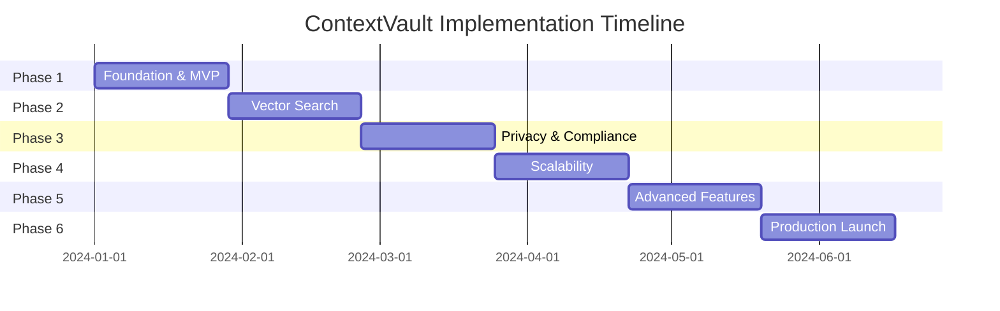

# ContextVault Implementation Plan

## Executive Summary

This implementation plan transforms the ContextVault blueprint into a production-ready system through a 6-phase approach, addressing critical gaps in security, compliance, cost optimization, and operational excellence.

## Phase 1: Foundation & MVP (Weeks 1-4)

### Core Infrastructure
```
Technology Stack:
- Backend: Node.js with Express.js / Python with FastAPI
- Database: MongoDB Atlas (development tier)
- Authentication: Auth0 / Firebase Auth
- Deployment: Docker containers on cloud provider
```

### MVP Features
- **User Management**: Basic registration, authentication, JWT tokens
- **Entry CRUD**: Create, read, update, delete conversational entries
- **Basic Search**: Full-text search using MongoDB text indexes
- **API Documentation**: OpenAPI/Swagger specifications

### Security Foundation
- Input validation and sanitization
- Rate limiting (100 requests/minute per user)
- HTTPS enforcement
- CORS configuration

### Deliverables
- Working API with core endpoints
- Docker containerization
- Basic CI/CD pipeline
- API documentation
- Local development environment setup

## Phase 2: Vector Search & Intelligence (Weeks 5-8)

### Vector Search Implementation
```
Embedding Strategy:
- Primary: Local sentence-transformers model (all-MiniLM-L6-v2)
- Fallback: OpenAI API for complex cases
- Hybrid approach: Combine full-text + vector search
```

### Enhanced Data Model
```json
{
  "id": "uuid",
  "user_id": "uuid",
  "source": {
    "type": "chatgpt|claude|manual",
    "version": "string",
    "export_date": "datetime"
  },
  "content": {
    "raw": "string",
    "processed": "string",
    "chunks": ["array of text chunks"],
    "tokens": "number"
  },
  "metadata": {
    "timestamp": "datetime",
    "tags": ["array"],
    "custom_fields": "object"
  },
  "embeddings": {
    "model": "string",
    "vector": [1536],
    "checksum": "string"
  },
  "privacy": {
    "is_sensitive": "boolean",
    "retention_date": "datetime",
    "anonymized": "boolean"
  },
  "schema_version": 2
}
```

### Search Capabilities
- Vector similarity search
- Hybrid search (text + semantic)
- Faceted search with filters
- Search result ranking and scoring

### Performance Optimizations
- MongoDB vector index implementation
- Caching layer with Redis
- Connection pooling
- Query optimization

## Phase 3: Data Privacy & Compliance (Weeks 9-12)

### GDPR Compliance
- **Data Minimization**: Only store necessary data
- **Consent Management**: User consent tracking and withdrawal
- **Right to Access**: User data export functionality
- **Right to Deletion**: Secure data deletion with audit trails
- **Data Portability**: Standard export formats (JSON, CSV)

### Privacy Features
```
Implementation:
- Personal data identification and tagging
- Automated data anonymization pipelines
- Geographic data residency controls
- Audit logging for all data operations
- Data retention policy enforcement
```

### Security Enhancements
- Advanced authentication (MFA support)
- Role-based access control (RBAC)
- API key management with scopes
- Encryption at rest and in transit
- Security headers and OWASP compliance

## Phase 4: Scalability & Performance (Weeks 13-16)

### Database Scaling
```
Sharding Strategy:
- Shard key: Composite of user_id + timestamp
- Index optimization for common query patterns
- Read replicas for search operations
- Write concern optimization
```

### Performance Architecture
- **Async Processing**: Background job queue (Bull/Celery)
- **Caching Strategy**: Multi-layer caching (L1: Memory, L2: Redis, L3: Database)
- **CDN Integration**: Static content delivery
- **Connection Optimization**: Connection pooling and keep-alive

### Monitoring & Observability
```
Monitoring Stack:
- APM: New Relic / DataDog
- Logs: ELK Stack / Splunk
- Metrics: Prometheus + Grafana
- Alerts: PagerDuty integration
- Health checks: Custom endpoints
```

### SLA Definitions
- API Response Time: P95 < 200ms, P99 < 500ms
- Search Latency: P95 < 1s for vector search
- Availability: 99.9% uptime
- Data Durability: 99.999999999% (11 9's)

## Phase 5: Advanced Features & Intelligence (Weeks 17-20)

### AI-Powered Features
- **Smart Tagging**: Automatic tag suggestion using NLP
- **Content Summarization**: Generate conversation summaries
- **Duplicate Detection**: Identify similar conversations
- **Trend Analysis**: Conversation topic trending over time

### Advanced Search
```
Features:
- Natural language queries ("find conversations about AI ethics")
- Temporal search ("conversations from last month about X")
- Similarity clustering
- Recommendation engine
- Search analytics and optimization
```

### Data Processing Pipeline
- **Ingestion**: Batch and streaming ingestion support
- **Processing**: Async embedding generation
- **Validation**: Schema validation and data quality checks
- **Enrichment**: Metadata extraction and enhancement

## Phase 6: Production & Operations (Weeks 21-24)

### Production Deployment
```
Infrastructure:
- Multi-region deployment
- Load balancing with health checks
- Auto-scaling groups
- Disaster recovery setup
- Backup automation (daily + incremental)
```

### Operational Excellence
- **Documentation**: Complete API docs, runbooks, troubleshooting guides
- **Training**: Team training on system operations
- **Support**: Incident response procedures and escalation paths
- **Maintenance**: Automated maintenance windows and updates

### Business Intelligence
- Usage analytics dashboard
- Cost optimization reports
- Performance trending
- User behavior insights

## Technical Architecture Details

### API Design Patterns
```
RESTful Conventions:
- Consistent resource naming
- Proper HTTP status codes
- Pagination with cursors
- Filtering and sorting standards
- API versioning strategy (v1, v2, etc.)
```

### Data Consistency
- **ACID Properties**: MongoDB transactions for critical operations
- **Eventual Consistency**: For non-critical updates
- **Conflict Resolution**: Last-write-wins with timestamps
- **Data Validation**: Schema validation at API and database levels

### Error Handling Strategy
```python
# Example error response structure
{
  "error": {
    "code": "VALIDATION_ERROR",
    "message": "Invalid input data",
    "details": {
      "field": "content",
      "issue": "Content exceeds maximum length"
    },
    "request_id": "uuid",
    "timestamp": "2024-01-01T00:00:00Z"
  }
}
```

## Risk Mitigation

### Technical Risks
- **Vendor Lock-in**: Abstract database operations, support multiple providers
- **Scale Challenges**: Implement horizontal scaling from day 1
- **Data Loss**: Comprehensive backup and replication strategy
- **Security Breaches**: Defense in depth, regular security audits

### Business Risks
- **Cost Overruns**: Implement cost monitoring and alerts
- **Compliance Violations**: Regular compliance audits and automated checks
- **Performance Degradation**: Proactive monitoring and capacity planning

## Cost Optimization Strategies

### Embedding Cost Reduction
```
Strategies:
1. Local Models: 90% cost reduction vs OpenAI API
2. Caching: Store computed embeddings, avoid recomputation
3. Batching: Process multiple entries in single API calls
4. Compression: Use quantized embeddings where appropriate
```

### Infrastructure Optimization
- Reserved instance pricing for predictable workloads
- Spot instances for batch processing jobs
- Storage tiering (hot/warm/cold data)
- CDN usage for static content

## Success Metrics

### Technical KPIs
- API Response Time (P95 < 200ms)
- Search Accuracy (>95% relevance)
- System Availability (99.9%)
- Error Rate (<0.1%)

### Business KPIs
- User Adoption Rate
- Data Ingestion Volume
- Search Query Success Rate
- Customer Satisfaction Score

## Deployment Timeline



## Resource Requirements

### Development Team
- **Backend Engineers**: 2-3 developers
- **DevOps Engineer**: 1 developer
- **Data Engineer**: 1 developer (part-time)
- **Security Specialist**: 1 consultant (part-time)
- **Project Manager**: 1 PM

### Infrastructure Costs (Monthly Estimates)
- **Development**: $500-1,000
- **Staging**: $1,000-2,000
- **Production**: $5,000-10,000 (scales with usage)

This implementation plan ensures ContextVault evolves from concept to production-ready system while addressing security, scalability, and operational requirements. 